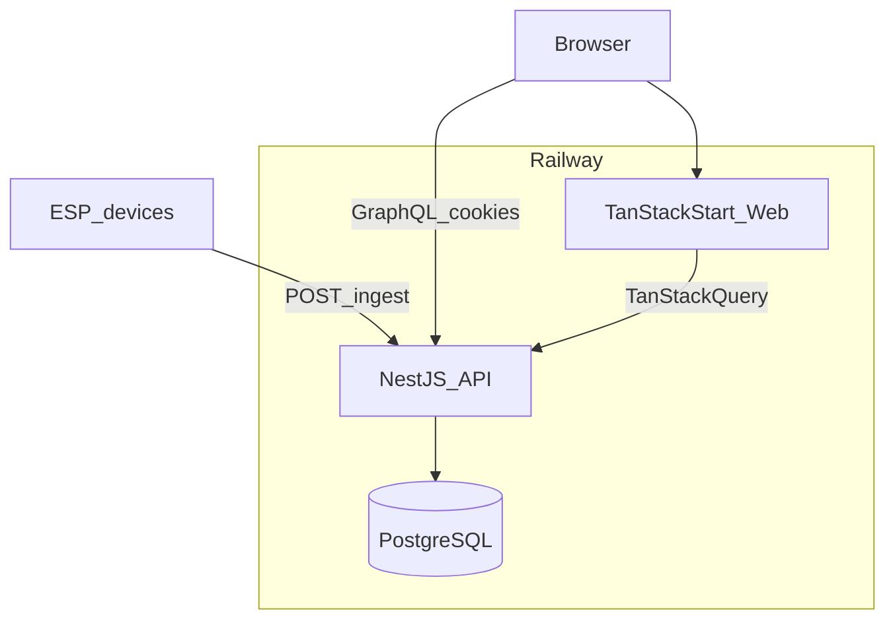

# Greenfield agent handoff — Aquaponics monitoring MVP

This document is the **primary bootstrap spec** for rebuilding the aquaponics monitoring MVP in a **new repository**. It encodes product behavior, data model, API contracts, and deployment assumptions distilled from the reference implementation in this repo (Next.js + Fastify + Apollo). **Do not port that stack file-for-file.** Implement the same capabilities on the target stack below.

## Target stack

| Layer         | Technology                                                                         |
| ------------- | ---------------------------------------------------------------------------------- |
| Web           | **TanStack Start** (routing, SSR where needed)                                     |
| Client data   | **TanStack Query** (`fetch` + `credentials: 'include'`) — **not** Apollo Client    |
| API           | **NestJS** (modules, guards, DI)                                                   |
| Dashboard API | **GraphQL** at `/graphql`                                                          |
| Device API    | **REST** `POST /ingest` only                                                       |
| Database      | **PostgreSQL** via **Kysely** in `packages/db`                                     |
| Hosting       | **Railway**: PostgreSQL + API service + web service                                |
| Monorepo      | **pnpm workspaces**; pin exact dependency versions (no `^` / `~`)                  |
| Email         | Resend                                                                             |
| Charts        | Nivo (or equivalent)                                                               |
| Styling       | Tailwind + local shadcn-style primitives                                           |
| Firmware      | PlatformIO project **outside** pnpm workspace; browser installer via esp-web-tools |

**NestJS is chosen for structure and conventions, not for lower memory use.** Expect a single Node API process on Railway to sit around **~200–250MB RSS** at idle; tune `PG_POOL_MAX` on the API service (e.g. `3`) rather than expecting a large drop from the framework alone.

---

## Read order for the implementing agent

1. This file (scope, architecture, contracts, Railway).
2. Follow **Build phases** in order; do not skip ahead unless a phase’s exit criteria are met.
3. Recreate `packages/db` types and migrations from the **Database** and **Migrations** sections (reference: `packages/db/src/types.ts` and `packages/db/src/migrations/` in the legacy repo).
4. Implement Nest GraphQL schema to match **GraphQL contract** below (reference SDL: `apps/api/src/graphql/schema.graphql`).
5. Implement `POST /ingest` per **Device ingestion** (legacy `docs/esp-device-ingest.md` is reference only for shape).
6. Scaffold TanStack Start routes per **Web routes**; wire TanStack Query to GraphQL.
7. Run **Definition of done** after **Phase 6**.

---

## Build phases

Implement the greenfield repo **in this order**. Each phase should be deployable enough to validate on Railway (or locally) before starting the next.

### Phase 1 — Backend foundation

- pnpm monorepo: `apps/api` (NestJS), `packages/db`, root scripts.
- Railway PostgreSQL (or local Postgres); `DATABASE_PUBLIC_URL` (public URL; Railway’s `DATABASE_URL` is often internal-only).
- Kysely client in `packages/db`; migration CLI; initial migrations for `users`, roles, `user_sites`, `sites` (minimal columns OK until later phases).
- Nest bootstrap: `DatabaseModule`, `HealthModule` (`GET /health`), GraphQL module shell, CORS, production logging.
- **Auth:** signed **JWT session cookie** only (HTTP-only); password hashing (bcrypt). See **Auth (greenfield)**.
- **RBAC:** guards for `admin`, `site_manager`, `site_viewer`; `requireSiteAccess` equivalent; GraphQL context loads current user from DB.
- **Exit criteria:** migrate + seed admin user; authenticated GraphQL `getMe`; non-admin cannot call admin-only fields.

### Phase 2 — Device ingestion

- `devices` table: `device_id`, `api_key_hash` (SHA-256), `site_id`, `last_seen_at`, `expected_interval_seconds`.
- `measurements` table + indexes (Timescale-ready `(taken_at, id)` PK).
- Seed `sensor_catalog` with MVP keys: `temperature`, `ph`, `waterLevel`, `waterFlow`.
- **`POST /ingest`:** `x-api-key`, zod payload validation, catalog key checks, partial readings allowed; **per-device rate limit** (see **Data and operational policies**).
- Persist measurements; update `devices.last_seen_at`.
- **Exit criteria:** curl ingest with seeded device key inserts rows; invalid key or unknown sensor key returns 4xx.

### Phase 3 — Dashboard

- `apps/web`: TanStack Start + TanStack Query; Tailwind shell.
- **Login** page; session cookie against Phase 1 auth.
- **Sites list** (`getSites`): status/last update as needed for list (may be simplified until Phase 4 alerts).
- **Site detail:** sensor summary + **charts** (`getMeasurements` / `getSensorMeasurements`, 24h/7d/30d). MVP charts read **raw measurements** from PostgreSQL queries — **no** server-side rollups or materialized aggregates initially.
- Responsive nav (sidebar `md+`, mobile drawer).
- **Exit criteria:** admin can log in, see sites, open site detail, view charts after ingest.

### Phase 4 — Alerts

- `alerts` table + partial unique index for active dedupe.
- **Anomaly engine** on ingest (and any scheduler hooks): range bands (warning + critical deltas), MVP spike/flatline heuristics, `range_violation:<key>` (critical) / `range_warning:<key>` (warning); respect `site_sensor_catalog` + `sensor_thresholds` (see **Effective threshold bands**).
- **Scheduler:** device offline detection using **heartbeat tolerance** (`max(expected_interval_seconds * 3, 15 minutes)`); critical re-notify loop; **single API instance** only (see **Scheduler ownership**).
- **Email:** Resend; cooldown (`COOLDOWN_MINUTES`); recipient resolution (admins + `user_sites`).
- Dashboard **alerts** views (global + per-site); `resolveAlert` if in contract.
- **Exit criteria:** out-of-range ingest creates alert; critical alert sends email (with cooldown); offline device alert fires from scheduler.

### Phase 5 — Admin tooling

- GraphQL admin queries/mutations: **users** (create/update, `resetAdminUserPassword`, site assignments), **sites** (CRUD, GPS, `sensorReporting`, `sensorThresholds`), **devices** (create, update, rotate API key, delete).
- Global **sensor catalog** CRUD; `site_sensor_catalog` enablement on site forms.
- TanStack Start **admin** routes; gate non-`admin` users.
- **Exit criteria:** admin can manage users/sites/devices without DB access; RBAC enforced on API.

### Phase 6 — Firmware installer + camera support

- PlatformIO firmware project (out of workspace); placeholder `firmware.bin`; **esp-web-tools** install wizard (Wi-Fi, API URL, sensor→GPIO map, MVP sensors + optional camera flag).
- `device_snapshots` metadata table; `devices.has_camera`, `report_interval_seconds`, `snapshot_interval_seconds`.
- **Object storage:** S3-compatible upload + presigned read URLs; **no Postgres image blobs** (see **Camera snapshots**); Railway bucket wiring may land here or immediately after.
- Ingest **commands** in JSON response: `reportIntervalSeconds`, `snapshotIntervalSeconds`, `captureImageNow` when device has active alert.
- Dashboard: latest snapshot on site/device detail when present.
- **Exit criteria:** install wizard flashes device; ingest returns commands; snapshot upload stores object + metadata; alert sets `captureImageNow`.

---

## Product scope

MVP for roughly **30 aquaponics sites**:

- Ingest device telemetry and optional **camera snapshots** over REST.
- Store **one normalized row per sensor reading** in `measurements`.
- Store **device camera snapshot metadata** in PostgreSQL; store **image bytes only in S3-compatible object storage** (not Postgres `bytea`).
- Derive site **health** from active alerts and enabled sensors.
- Detect **explainable** anomalies (range, spike/drop, flatline on MVP sensor keys; generic range types for other catalog keys).
- **Email** operators on **critical** alerts with per-(site, type) cooldown.
- **Dashboard**: site list + map, site detail + charts, **latest device camera snapshot** (when present), alerts (global + per-site), account settings.
- **Admin** (`admin` role): users, sites, devices (API keys + install wizard), global sensor catalog, per-site sensor enablement and threshold overrides.

**Non-goals for v1:** microservices, message queues, TimescaleDB (schema should stay upgrade-ready), SMS/Slack/webhooks, formal CI test suite, automatic firmware rebuild in CI.

---

## Architecture

```text
Browser ──► TanStack Start (web) ──► GraphQL + cookies ──► NestJS API ──► PostgreSQL
ESP devices ──► POST /ingest + x-api-key ──► NestJS API ──► PostgreSQL
```



### Monorepo layout

```text
apps/
  api/          NestJS: GraphQL, /ingest, scheduler, mail
  web/          TanStack Start + TanStack Query
packages/
  db/           Kysely client, types, migrations, seed CLI
firmware/
  aquaponics-node/   PlatformIO; not a pnpm workspace
docs/
  esp-device-ingest.md   device HTTP contract (copy or link from legacy)
```

Railway **root directory** for both `api` and `web` services must be the **repository root** so builds can access `packages/db`.

---

## Engineering constraints

- **One** Node API service; no queues for MVP.
- **Do not** expose device ingestion through GraphQL.
- **RBAC** enforced in API resolvers/guards; UI hiding is convenience only.
- **Exact** package versions in all `package.json` files.
- GraphQL schema stays **flat** (avoid deep nesting until the UI needs it).
- `measurements` primary key **`(taken_at, id)`**; do not add unique constraints that exclude `taken_at` (Timescale hypertable path).
- **Timestamps:** store and compare instants in **UTC only** (see **Data and operational policies**).
- Generated GraphQL types: gitignored; regenerate via `pnpm codegen`.
- After contract or env changes, update human README and agent docs.
- Follow **MVP implementation philosophy** below; do not add infrastructure listed there without an explicit later request.

---

## MVP implementation philosophy

Prefer straightforward **synchronous** implementations over extensible abstractions.

**Do not introduce:**

- Event buses
- CQRS
- Repository layers beyond Kysely helpers
- Redis
- Kafka
- Microservices
- WebSocket infrastructure
- Generic plugin systems
- Background job frameworks (use `@nestjs/schedule` in-process only)

The system target is **~30 sites** and a **single API process**. Optimize for maintainability and operational simplicity.

---

## Database

Canonical table map to recreate in Kysely (`Database` interface):

| Table                 | Purpose                                                                                                                                                                                                                                                                                                                                                                                                                                                                                                                                             |
| --------------------- | --------------------------------------------------------------------------------------------------------------------------------------------------------------------------------------------------------------------------------------------------------------------------------------------------------------------------------------------------------------------------------------------------------------------------------------------------------------------------------------------------------------------------------------------------- |
| `users`               | Auth users; `role` (`admin` \| `site_manager` \| `site_viewer`); `password_hash`                                                                                                                                                                                                                                                                                                                                                                                                                                                                    |
| `sites`               | Name, location, optional `latitude` / `longitude`                                                                                                                                                                                                                                                                                                                                                                                                                                                                                                   |
| `devices`             | `device_id`, `api_key_hash` (SHA-256), `site_id` (nullable), `last_seen_at`, `expected_interval_seconds`, optional `report_interval_seconds`, `snapshot_interval_seconds`, `has_camera`, optional `name`, `board`, `pin_map` jsonb                                                                                                                                                                                                                                                                                                                  |
| `user_sites`          | Many-to-many site assignments for non-admins                                                                                                                                                                                                                                                                                                                                                                                                                                                                                                        |
| `sensor_catalog`      | Global sensor definitions: `key`, display name, unit, physical min/max, sort order, optional `icon`                                                                                                                                                                                                                                                                                                                                                                                                                                                 |
| `site_sensor_catalog` | Per-site enablement per catalog sensor                                                                                                                                                                                                                                                                                                                                                                                                                                                                                                              |
| `sensor_thresholds`   | Per-site threshold configuration keyed by `(site_id, sensor)` where `sensor` = catalog `key`. Columns: `normal_min`, `normal_max` (the target operating range, nullable — fall back to `sensor_catalog.physical_min/max`), `warning_delta` (± buffer beyond normal bounds that triggers a **warning** alert, nullable), `critical_delta` (± buffer beyond normal bounds that triggers a **critical** alert, nullable; should be ≥ `warning_delta` for sensible semantics)                                                                           |
| `measurements`        | Time series: `id UUID DEFAULT gen_random_uuid()`, `site_id`, `device_id` (nullable), `sensor`, `value` (**PostgreSQL `double precision`**), `taken_at` (`timestamptz`), `ingested_at`. Composite primary key `(taken_at, id)` (TimescaleDB-ready). **Required indexes (add in initial migration — chart queries will be slow without them):** `(site_id, sensor, taken_at DESC)` for sensor history; `(device_id, taken_at DESC)` for device detail. Do not add unique constraints that exclude `taken_at`; that would break hypertable conversion. |
| `device_snapshots`    | Snapshot **metadata** only: `device_id`, `site_id`, `taken_at`, `ingested_at`, `content_type`, `byte_size`, `storage_bucket`, `storage_key` (object key in S3-compatible storage). **No image bytes in Postgres.**                                                                                                                                                                                                                                                                                                                                  |
| `alerts`              | `site_id`, optional `device_id`, `type`, `severity`, `status` (`'active'` \| `'resolved'`), `message`, `last_notified_at`; partial unique index enforced as `WHERE status = 'active'` on `(site_id, type)` — only one active alert per `(site_id, type)` at a time                                                                                                                                                                                                                                                                                  |

### Migration sequence (intent)

Greenfield **does not** copy legacy dissolved-oxygen assumptions. Seed the global `sensor_catalog` with exactly these MVP keys: **`temperature`**, **`ph`**, **`waterLevel`**, **`waterFlow`** (units and physical bounds are admin-defined; typical units: °C, pH, % or cm, L/min or GPM).

Mirror legacy migration **shape** where still applicable (`0001`–`0011` in the reference repo): auth + roles → core sites/devices/user_sites/thresholds → measurements → alerts → geo → sensor catalog + site_sensor_catalog → flexible catalog keys on measurements/thresholds → device admin fields → nullable device `site_id` → sensor `icon` → **device snapshots + device interval/camera columns** (new in greenfield).

### Seed

Create one **admin** user, one **site**, one **device**; print the device **plaintext API key once** (store only hash in DB).

### Pool tuning

Shared `createDb()` in `packages/db` should honor **`PG_POOL_MAX`** (default `10`, clamp 1–32). Set **`PG_POOL_MAX=3`** (or similar) on the **API** Railway service only.

### Measurement retention (policy only)

- **Measurements are retained indefinitely** in PostgreSQL for the initial greenfield MVP. **Do not** implement downsampling, rollups, cold storage, or automated deletion/archiving unless explicitly requested later.
- Downsampling and retention policies are **deferred**; future agents should not invent archiving subsystems without a new product decision.

---

## Data and operational policies

### Timestamps (UTC only)

- Persist `taken_at`, `ingested_at`, alert timestamps, and snapshot metadata in **UTC** (`timestamptz` in Postgres; normalize to UTC in application code).
- Device payloads must use **ISO 8601 UTC** with a `Z` suffix (e.g. `2026-05-01T15:00:00.000Z`). Reject or normalize ambiguous offsets consistently; **do not** store site-local wall times in the database.
- Dashboards may **display** local time in the browser, but APIs and storage remain UTC.

### Device heartbeat and offline threshold

Spotty Wi-Fi, site power flickers, and short internet outages should not spam `device_offline` alerts. The scheduler compares `devices.last_seen_at` to a per-device tolerance:

```text
offline_threshold_seconds = max(expected_interval_seconds * 3, 15 minutes)
```

(`15 minutes` = `900` seconds.) Mark a device offline and upsert `device_offline` only when `last_seen_at` is null or older than **`now() - offline_threshold_seconds`**. Successful ingest clears/resolves the offline alert as today. Re-evaluate on each scheduler tick (~60s); do not tighten this formula without an explicit product change.

### Ingest rate limiting (`POST /ingest`)

Apply a **simple per-device** rate limit keyed by authenticated device (API key / `device_id`), not by client IP alone. Mitigates firmware bugs, reboot loops, and malformed retry storms.

- Return **HTTP 429** when exceeded; include **`Retry-After`** when practical.
- **Implementation is in-memory per API instance for MVP.** If Railway scales to multiple replicas, per-device counters are not shared — a device could post at `N × rate_limit` across replicas without triggering 429. This is a known limitation; do not attempt to fix it with Redis for the MVP. Bold flag: **in-memory rate limiting is not consistent across Railway replicas.**
- Suggested default: cap at roughly **one accepted telemetry request per `expected_interval_seconds`** per device, with a small burst allowance (exact numbers tunable via env, e.g. `INGEST_RATE_LIMIT_*`).

### Ingest delivery semantics

- **`POST /ingest` is at-least-once** from the device perspective (retries, flaky networks). The API may insert **duplicate** measurement rows if the same payload is posted more than once.
- **Do not** add MVP dedupe constraints or idempotency keys unless explicitly requested later.
- Charts, dashboards, and downstream consumers should **tolerate occasional duplicate points** (or apply lightweight client-side handling); do not require perfect uniqueness in v1.

### Scheduler ownership

- MVP assumes **one API instance** runs in-process scheduler tasks (`@nestjs/schedule`).
- **Do not** implement distributed locks, leader election, or Redis-backed job ownership for the scheduler.
- If Railway **replica count** is increased later, scheduler ownership and duplicate-job risk must be revisited before scaling horizontally.
- **If two instances accidentally run concurrently** (e.g. Railway rolling deploy overlap): duplication must be **safe** via DB-level idempotency for every scheduler output:
  - Alert upsert: idempotent via partial unique index (`WHERE status = 'active'` on `(site_id, type)`).
  - Re-notify emails: idempotent via `alerts.last_notified_at` — the scheduler checks `now() - last_notified_at > COOLDOWN_MINUTES` before sending; a concurrent second instance will see the same `last_notified_at` value (updated by the first) and skip. **This is the only email-send guard; it must be an atomic `UPDATE ... WHERE last_notified_at < threshold` to avoid a race window.**
- Do not attempt to "fix" dual-run with Redis or a job queue — that is a deliberate non-goal for the MVP.

---

## NestJS API blueprint

### Suggested modules

| Module               | Responsibility                                                                                                                                                               |
| -------------------- | ---------------------------------------------------------------------------------------------------------------------------------------------------------------------------- |
| `DatabaseModule`     | Kysely / `pg` pool, inject `DB` token                                                                                                                                        |
| `AuthModule`         | Login, session/JWT cookie, `AuthGuard`, current user in GraphQL context                                                                                                      |
| `GraphqlModule`      | `/graphql`, code-first or schema-first (pick one; keep SDL in repo as source of truth)                                                                                       |
| `SitesModule`        | `getSites`, `getSite`, status derivation                                                                                                                                     |
| `MeasurementsModule` | `getMeasurements`, `getSensorMeasurements`                                                                                                                                   |
| `AlertsModule`       | `getAlerts`, `resolveAlert`, upsert/dedupe, Resend notifier                                                                                                                  |
| `AnomalyModule`      | Range/spike/flatline rules on ingest                                                                                                                                         |
| `IngestModule`       | `POST /ingest` (JSON telemetry), `POST /ingest/snapshot` (multipart image), `x-api-key`, zod validation, **per-device rate limit**, **command** fields in telemetry response |
| `AdminModule`        | Admin queries/mutations, sensor catalog CRUD                                                                                                                                 |
| `DevicesModule`      | Admin device CRUD, API key generation/rotation                                                                                                                               |
| `StorageModule`      | S3-compatible client; upload snapshot objects; presigned read URLs for dashboard                                                                                             |
| `SchedulerModule`    | `@nestjs/schedule`: device offline check (~60s), critical re-notify (~5m)                                                                                                    |
| `HealthModule`       | `GET /health` → `{ ok: true }`                                                                                                                                               |

Use **guards** for `admin` and **site access** (`requireSiteAccess` equivalent: admin sees all; others only assigned `user_sites`).

### HTTP surface

| Method | Path               | Auth                                                                 |
| ------ | ------------------ | -------------------------------------------------------------------- |
| POST   | `/graphql`         | Session cookie for dashboard operations                              |
| POST   | `/ingest`          | `x-api-key` — JSON telemetry only (see **Device ingestion**)         |
| POST   | `/ingest/snapshot` | `x-api-key` — multipart image upload only (see **Camera snapshots**) |
| GET    | `/health`          | None                                                                 |

### CORS

- **Production:** allow single `WEB_ORIGIN` with `credentials: true`.
- **Development:** reflect request `Origin` if helpful for localhost vs `127.0.0.1`.

### Logging

Production: avoid per-request access logs at `info`; use `warn`+ for API process.

### In-process scheduler

- **Single instance:** scheduler jobs run only in the one deployed API process (see **Scheduler ownership**).
- **Device offline:** compare `last_seen_at` to **`offline_threshold_seconds = max(expected_interval_seconds * 3, 900)`** before upserting `device_offline` (see **Device heartbeat and offline threshold**).
- **Re-notify:** active critical alerts (`alerts.status = 'active'` + `severity = 'critical'`) → email if cooldown (`COOLDOWN_MINUTES`, default 45) allows.

### Anomaly / alert types (MVP)

MVP sensor catalog keys: **`temperature`**, **`ph`**, **`waterLevel`**, **`waterFlow`**. **Do not** seed or document dissolved-oxygen (`dissolvedOxygen`) sensors or `low_oxygen` alerts for greenfield.

| Alert type                                                               | Notes                                                                                                |
| ------------------------------------------------------------------------ | ---------------------------------------------------------------------------------------------------- |
| `ph_drift`, `temperature_spike`, `water_level_issue`, `water_flow_issue` | MVP heuristics + `_flatline` variants where applicable                                               |
| `range_warning:<key>`                                                    | Severity `warning`. Fires from step 2 or step 3 of the **Alert severity decision tree** (see below). |
| `range_violation:<key>`                                                  | Severity `critical`. Fires from step 1 of the **Alert severity decision tree** (see below).          |
| `device_offline`                                                         | Severity `critical`. Scheduler-generated; cleared on successful ingest.                              |

**Alert coexistence:** alert types operate independently. A single device reading can produce multiple simultaneous active alerts of different types (e.g. `ph_drift` + `range_warning:ph` + `device_offline` can all be `status = 'active'` at the same time for the same site). The partial unique index deduplicates only within `(site_id, type)` — one active alert per type, not one alert total per site. The **Alert severity decision tree** below defines severity within range-band evaluation for a single sensor key; it does not establish priority between different alert types.

**Anomaly idempotency:** the anomaly engine runs on every ingest, including at-least-once duplicates. It must be safe to run on the same `(device_id, sensor, taken_at)` more than once without escalating alerts. The alert deduplication index (`WHERE status = 'active'` on `(site_id, type)`) is the idempotency mechanism — rely on alert upsert semantics, not row-level measurement dedupe. Duplicate ingest may still cause redundant anomaly re-evaluation churn; this is a known gap (see **Post-MVP / deferred work**).

**Effective threshold bands** — compute only when the corresponding delta is set:

```
normal_min = sensor_thresholds.normal_min ?? sensor_catalog.physical_min
normal_max = sensor_thresholds.normal_max ?? sensor_catalog.physical_max

// only when warning_delta IS NOT NULL:
warning_low  = normal_min - warning_delta
warning_high = normal_max + warning_delta

// only when critical_delta IS NOT NULL:
critical_low  = normal_min - critical_delta
critical_high = normal_max + critical_delta
```

Deltas are symmetric in v1 (same ± on both sides of the normal band). Asymmetric per-side deltas (`warning_low_delta`, `warning_high_delta`, `critical_low_delta`, `critical_high_delta`) are a post-MVP upgrade path. Do not add them without explicit request: asymmetry changes alert classification semantics and requires migration logic for existing threshold rows — it is not a non-breaking column addition.

**Alert severity decision tree** — short-circuit, evaluate top to bottom, stop at first match:

```
// Step 1 — critical check
if critical_delta IS NOT NULL:
  if value < critical_low OR value > critical_high:
    → CRITICAL  (range_violation:<key>)  STOP
// if critical_delta IS NULL: skip step 1 entirely — no implicit default fires

// Step 2 — warning check
if warning_delta IS NOT NULL:
  if value < warning_low OR value > warning_high:
    → WARNING  (range_warning:<key>)  STOP
// if warning_delta IS NULL: skip step 2 entirely — no implicit default fires

// Step 3 — normal-range fallback
// Runs when: both deltas null, one delta set but didn't match,
// or value sits in the gap between the normal edge and the warning threshold.
if value < normal_min OR value > normal_max:
  → WARNING  (range_warning:<key>)  STOP

// Step 4
→ no range alert
```

**Null-delta contract** — implementation must follow these exactly:

- `warning_delta = null` → step 2 is skipped. Step 3 becomes the first warning check. Null does not mean zero.
- `critical_delta = null` → step 1 is skipped. Critical severity cannot fire via range-band logic; only `range_warning` is possible.
- `warning_delta` set, `critical_delta` null → warning band exists; no critical band; values inside the warning zone (between normal edge and warning threshold) reach step 3 and fire as warning.
- Both null → only step 3 runs; any out-of-normal-range reading fires `range_warning`.
- `critical_delta` must be ≥ `warning_delta` when both are set; validate on admin save and reject if violated.
- Exactly one alert fires per reading per sensor — the first match wins. There is no stacking.

Run detection only for sensors **enabled** in `site_sensor_catalog`.

---

## GraphQL contract

Implement the following operations (full SDL reference: legacy `apps/api/src/graphql/schema.graphql`).

**"Flat" GraphQL:** this means read queries return flat bounded lists with no deeply-nested resolver chains that cause N+1 queries. Admin mutations **do** accept structured input objects (nested arrays for threshold/sensor config per site) — that is intentional, not a contradiction. "Flat" constrains resolver depth and read-path complexity, not mutation input shape.

**Pagination:** MVP queries may return **simple bounded lists** (sensible `LIMIT`s, time-range filters). **Do not** introduce Relay-style connections, cursors, or `PageInfo` unless explicitly requested later.

### Queries

- `getSites` — assigned sites for non-admin; all for admin; includes `sensorReporting`, derived `status`, `lastUpdate`, `role`.
- `getSite(id)` — same shape; omit disabled sensors from measurements/alerts in responses where applicable.
- `getMeasurements(siteId, range)` — `TimeRange`: `LAST_24H` \| `LAST_7D` \| `LAST_30D`.
- `getSensorMeasurements(siteId, sensorKey, range)` — single-sensor series.
- `getAlerts(siteId?, type?, status?)` — filtered list; respect site access.
- `getMe` — authenticated profile.
- `sensorCatalog` — **admin only**.
- `adminUsers`, `adminSites` — **admin only**.
- `adminDevices(siteId?)`, `adminDevice(id)` — **admin only**; expose `hasCamera`, `reportIntervalSeconds`, `snapshotIntervalSeconds`, and recent snapshot metadata for the dashboard.

### Mutations

- `updateMe(input)` — requires `currentPassword`; optional name, email, newPassword; sign out client after success.
- `createAdminUser` / `updateAdminUser` — **admin**; password min 8 chars; `assignedSiteIds` replaces join rows on update; cannot demote last admin.
- `resetAdminUserPassword(id, newPassword)` — **admin**; no current password.
- `createAdminSite` / `updateAdminSite` — **admin**; GPS lat/lng together; `sensorReporting` for every catalog sensor; optional `sensorThresholds` as `{ key, normalMin, normalMax, warningDelta, criticalDelta }` per sensor (all nullable — null = use catalog default for that bound); `criticalDelta` must be ≥ `warningDelta` when both are set; optional `deviceId` to attach device.
- `createSensorCatalogEntry` / `updateSensorCatalogEntry` / `deleteSensorCatalogEntry` — **admin**; new catalog row → `site_sensor_catalog` for all sites with **`enabled: false`**.
- `createAdminDevice` / `updateAdminDevice` / `rotateAdminDeviceApiKey` / `deleteAdminDevice` — **admin**; plaintext API key returned once on create/rotate.
- `resolveAlert(id)` — user with site access may dismiss.

Scalars: `DateTime`, `JSON` (e.g. `pinMap`).

---

## Device ingestion (`POST /ingest`)

Greenfield extends the legacy ingest contract (`docs/esp-device-ingest.md` in the reference repo) with the rules below. **Do not** treat dissolved oxygen as an MVP sensor.

### Telemetry (`application/json`)

- Header: `x-api-key` (plaintext; server stores SHA-256 hash).
- Body: `{ deviceId, timestamp (ISO 8601 **UTC**, `Z` suffix), readings: { [catalogKey]: number } }` — at least one reading **or** a snapshot part in a multipart request (see **Camera snapshots**); unknown sensor keys → **400** entire request rejected.
- **Rate limit:** per-device cap on `POST /ingest` (429 + `Retry-After`); see **Ingest rate limiting**.
- Allowed MVP reading keys: `temperature`, `ph`, `waterLevel`, `waterFlow` (plus any additional keys later added via admin catalog CRUD).
- **Reading values:** each `readings` value must be a **finite IEEE-754 number**. Reject `NaN`, `Infinity`, `-Infinity`, and non-numeric payloads with **HTTP 400**. Persist as PostgreSQL **`double precision`**.
- **At-least-once:** retries may create duplicate rows; see **Ingest delivery semantics**.
- On success: insert measurements, update `devices.last_seen_at`, resolve active `device_offline` for site, run anomaly pipeline for enabled sensors, return **commands** (below).

### Camera snapshots (`POST /ingest/snapshot`)

Image uploads use a **separate** endpoint from telemetry. This keeps the firmware protocol simple (telemetry and images are never mixed in one request), keeps the ingest parsing surface small, and makes each endpoint independently testable.

**Endpoint:** `POST /ingest/snapshot`
**Content-Type:** `multipart/form-data`

Canonical part layout:

| Part name  | `Content-Type`                       | Required | Content                                      |
| ---------- | ------------------------------------ | -------- | -------------------------------------------- |
| `metadata` | `application/json` (as string value) | Yes      | `{ "deviceId": "...", "timestamp": "...Z" }` |
| `image`    | `image/jpeg`                         | Yes      | Compressed JPEG binary                       |

Rules:

- Both `metadata` and `image` are required; reject with **400** if either is missing.
- **Firmware must send compressed JPEG only.** Reject other content types with **400**.
- **Maximum image size: 5 MB.** Reject with **413** if `image` exceeds this.
- Apply per-device rate limit (same token as `POST /ingest`).
- On success: store image to object storage; insert row into `device_snapshots`; update `devices.last_seen_at`.
- Response: `{ "ok": true }` (no command fields; commands are issued via `POST /ingest` responses only).

#### Object storage rollout (Railway)

- **Target:** S3-compatible bucket (AWS S3, Cloudflare R2, MinIO, etc.) reachable from the Nest API service on Railway.
- **Build phase 6:** implement the storage interface, metadata table, and ingest path; snapshot ingest may return **503** until bucket env vars are set.
- **After phase 6 (deploy):** provision bucket + credentials on Railway (or attached provider), set env vars on the API service, enable snapshot ingest in production.
- Suggested env vars (API only): `OBJECT_STORAGE_ENDPOINT`, `OBJECT_STORAGE_REGION`, `OBJECT_STORAGE_BUCKET`, `OBJECT_STORAGE_ACCESS_KEY_ID`, `OBJECT_STORAGE_SECRET_ACCESS_KEY`, optional `OBJECT_STORAGE_FORCE_PATH_STYLE` for MinIO-style endpoints.

### Response body (commands)

Every successful ingest response includes telemetry ack fields **and** optional **device commands** the firmware must apply until the next response:

```json
{
  "ok": true,
  "inserted": 4,
  "commands": {
    "reportIntervalSeconds": 300,
    "snapshotIntervalSeconds": 900,
    "captureImageNow": false
  }
}
```

| Field                     | Meaning                                                                                                                                                                                                                                                                                                                                                                                                                                                                                                                                                                                                                                       |
| ------------------------- | --------------------------------------------------------------------------------------------------------------------------------------------------------------------------------------------------------------------------------------------------------------------------------------------------------------------------------------------------------------------------------------------------------------------------------------------------------------------------------------------------------------------------------------------------------------------------------------------------------------------------------------------- |
| `reportIntervalSeconds`   | Server-authoritative telemetry POST interval. Admins change this in the device manager; firmware should replace its local interval when this field is present.                                                                                                                                                                                                                                                                                                                                                                                                                                                                                |
| `snapshotIntervalSeconds` | Interval for **unsolicited** snapshot uploads when `has_camera` is true.                                                                                                                                                                                                                                                                                                                                                                                                                                                                                                                                                                      |
| `captureImageNow`         | When `true`, device must **POST a new image** to `POST /ingest/snapshot` as soon as practical (before the next snapshot interval). **This field is derived on every response** — the server queries whether the device's site has any active alert (`alerts.status = 'active'`). There is no server-side state or TTL for this flag; it reappears on every ingest response as long as any active alert exists, so the device will receive it again on its next telemetry POST if the alert has not cleared. Firmware should attempt one snapshot per received `true`, then wait for the next ingest response before deciding to send another. |

Admins **manually** change `reportIntervalSeconds` / `snapshotIntervalSeconds` via admin device update; the next ingest response reflects the new values.

### Example (telemetry only)

```bash
curl -X POST "$API_URL/ingest" \
  -H "content-type: application/json" \
  -H "x-api-key: <device-api-key>" \
  -d '{
    "deviceId": "device-123",
    "timestamp": "2026-05-01T15:00:00.000Z",
    "readings": {
      "temperature": 24.3,
      "ph": 6.8,
      "waterLevel": 72,
      "waterFlow": 1.2
    }
  }'
```

Example success response:

```json
{
  "ok": true,
  "inserted": 4,
  "commands": {
    "reportIntervalSeconds": 300,
    "snapshotIntervalSeconds": 900,
    "captureImageNow": true
  }
}
```

---

## Auth (greenfield)

The legacy app used **Auth.js on Next.js** and verified cookies on the API. Greenfield uses **signed JWT session cookies only** end-to-end.

- Nest issues an **HTTP-only** cookie containing a **signed JWT** on login (GraphQL mutation or REST login). TanStack Query uses `credentials: 'include'` for all API calls.
- **Session lifetime:** **30 days** from issue. **Rolling renewal:** the API **re-issues** a fresh JWT cookie on any authenticated GraphQL request when the current token has **fewer than 7 days remaining** (i.e. re-issue if `exp - now < 7 days`). No other renewal path exists (no refresh-token endpoint). The client replaces the cookie transparently via the `Set-Cookie` response header.
- **Logout:** clear the session cookie **client-side** (`Max-Age=0` / delete cookie) and treat the session as ended; the API does **not** maintain a server-side session store. **JWT verification is signature + expiry only** — no server-side revocation list in MVP.
- Email + password (bcrypt cost 12). Load authoritative `role` from Postgres on each GraphQL request (claims may hint but DB wins).
- Profile update with current password; admin reset without current password.
- Shared **`AUTH_SECRET`** for signing; cookie `Secure` on HTTPS; document dev vs production cookie names.

**Do not implement unless explicitly requested later:** refresh tokens, OAuth/social providers, Redis-backed sessions, Auth.js adapters, or database `sessions` tables for dashboard auth.

---

## TanStack Start + TanStack Query (web)

### Routing map (legacy Next → TanStack Start)

| Legacy route                                                         | Purpose                                            |
| -------------------------------------------------------------------- | -------------------------------------------------- |
| `/login`                                                             | Credentials login                                  |
| `/sites`                                                             | Site list + overview map                           |
| `/sites/$id`                                                         | Site detail, charts, alerts summary                |
| `/sites/$id/alerts`                                                  | Site-scoped alerts                                 |
| `/sites/$id/sensors/$sensorKey`                                      | Single-sensor chart                                |
| `/alerts`                                                            | Global alerts + filters                            |
| `/settings`                                                          | Profile / password                                 |
| `/admin`                                                             | Users, sites, links to devices/sensors             |
| `/admin/users/new`, `/admin/users/$id/edit`                          | User CRUD + password reset section                 |
| `/admin/sites/new`, `/admin/sites/$id/edit`                          | Site CRUD + map picker + sensor toggles/thresholds |
| `/admin/devices`, `/admin/devices/new`, `/admin/devices/$id/install` | Device manager + esp-web-tools wizard              |
| `/admin/sensors`, `/admin/sensors/new`, `/admin/sensors/$id/edit`    | Global catalog CRUD                                |

Gate `/admin/*` server- or client-side: non-`admin` → redirect `/sites`.

### Navigation UX

- Desktop (`md+`): fixed left sidebar — Sites, Alerts, Admin (if admin), org logo.
- Mobile: header with menu drawer exposing the same links.

### TanStack Query patterns

- Single `QueryClient` in app root.
- `graphqlRequest<T>(query, variables)` wrapper: `POST` to `import.meta.env.VITE_PUBLIC_API_URL/graphql` (or framework-equivalent public env) with `credentials: 'include'`.
- `useQuery` keys: e.g. `['sites']`, `['site', id]`, `['measurements', siteId, range]`.
- `useMutation` + `onSuccess` → `queryClient.invalidateQueries` for affected keys (replace Apollo cache updates).
- Prefer **GraphQL Codegen** with operations under `apps/web/src/graphql/operations/` generating typed document strings; wire hooks manually or via a thin helper (no Apollo Client).

### Maps and installer

- `VITE_PUBLIC_GOOGLE_MAPS_EMBED_API_KEY` (or equivalent): Maps Embed on site detail; Maps JavaScript API on admin site form picker.
- Firmware: static `public/firmware/<board>/firmware.bin`; patch 2 KiB config region (`__UD_CFG_BEGIN__` / `__UD_CFG_END__`); esp-web-tools manifest from in-memory patched bytes; placeholder binary acceptable until PlatformIO build is wired. Installer/config must support MVP sensors (`temperature`, `ph`, `waterLevel`, `waterFlow`) and optional **camera** flag + default intervals.

---

## RBAC matrix

| Role           | Sites              | Admin UI | Ingest      |
| -------------- | ------------------ | -------- | ----------- |
| `admin`        | All                | Full     | N/A         |
| `site_manager` | Assigned           | Hidden   | N/A         |
| `site_viewer`  | Assigned read-only | Hidden   | N/A         |
| Device         | N/A                | N/A      | `x-api-key` |

---

## Environment variables

Copy pattern: per-package `.env` for local dev (`packages/db`, `apps/api`, `apps/web`).

| Variable                                 | API      | Web      | Notes                                                                                                        |
| ---------------------------------------- | -------- | -------- | ------------------------------------------------------------------------------------------------------------ |
| `DATABASE_PUBLIC_URL`                    | yes      | yes\*    | Postgres connection string; on Railway prefer the **public** URL variable, not internal-only `DATABASE_URL`. \*Web only if login verifies passwords in-process; prefer API-only DB access |
| `AUTH_SECRET`                            | yes      | yes      | Signs JWT session cookies (30-day rolling lifetime)                                                          |
| `WEB_ORIGIN`                             | yes      | —        | CORS production                                                                                              |
| `PUBLIC_API_URL` / `VITE_PUBLIC_API_URL` | —        | yes      | Browser GraphQL base                                                                                         |
| `RESEND_API_KEY`                         | yes      | —        |                                                                                                              |
| `ALERT_FROM_EMAIL`                       | yes      | —        |                                                                                                              |
| `COOLDOWN_MINUTES`                       | optional | —        | default 45                                                                                                   |
| `PG_POOL_MAX`                            | optional | optional | Lower on API                                                                                                 |
| `OBJECT_STORAGE_*`                       | optional | —        | S3-compatible snapshot storage; required in production once snapshots are enabled (see **Camera snapshots**) |
| `INGEST_RATE_LIMIT_*`                    | optional | —        | Per-device `POST /ingest` caps (see **Ingest rate limiting**)                                                |
| `PORT`                                   | yes      | yes      | Railway sets                                                                                                 |

Local ports (suggested): web **3333**, API **4000**.

---

## Railway deployment

1. Create PostgreSQL service.
2. Deploy **API** from repo root: `pnpm build:api` / `pnpm start:api` (define scripts in root `package.json`).
3. Run `pnpm migrate:deploy`.
4. Optional `pnpm seed`.
5. Deploy **web** from repo root: `pnpm build:web` / `pnpm start:web`.
6. Set API `WEB_ORIGIN` to deployed web URL.
7. Set web public API URL to deployed API URL.

Document exact TanStack Start production start command for the chosen framework version in the new repo README.

---

## Definition of done

Complete **Build phases 1–6**, then:

```bash
pnpm install
pnpm codegen
pnpm typecheck
pnpm build:api
pnpm build:web
pnpm migrate
pnpm seed   # optional
pnpm dev    # web + api
```

Manual smoke:

- Login as admin; `getMe` via UI settings.
- Sites list and site detail charts.
- `POST /ingest` with seed device key updates site; response `commands` updates firmware intervals; active device alert yields `captureImageNow: true`.
- Admin: create user, reset password, create site, create device, install wizard loads firmware path.
- Non-admin assigned to one site cannot open admin routes.

---

## Post-MVP / deferred work

- Automated integration tests.
- TimescaleDB hypertable migration.
- Measurement **downsampling / retention / archiving** (initial policy: retain all rows indefinitely).
- Ingest **idempotency / dedupe** keys (measurement-level; prevents duplicate rows under at-least-once delivery).
- Per-reading anomaly evaluation idempotency via `(device_id, sensor, taken_at)` — eliminates duplicate re-evaluation churn caused by retried ingests; alert upsert dedup is the only safeguard in MVP.
- GraphQL **cursor / Relay pagination**.
- Server-side chart **rollups / materialized aggregates**.
- Distributed **scheduler** locks when running multiple API replicas.
- Refresh tokens, OAuth, Redis sessions, Auth.js adapters.
- Real firmware CI; replace placeholder `firmware.bin`.
- ESP32 CYD board target (stub "coming soon" in wizard).
- TLS pinning / Improv Wi-Fi on devices.
- **Railway + S3-compatible object storage** provisioned and wired for production camera snapshots (metadata schema and ingest path should exist before this).

---

## Legacy reference repo

When behavior is ambiguous, consult the **legacy** implementation in this repository (paths relative to monorepo root):

- `AGENTS.md` — feature map and constraints
- `apps/api/src/graphql/schema.graphql` — SDL
- `packages/db/src/migrations/` — schema evolution
- `docs/esp-device-ingest.md` — legacy device contract (**dissolved oxygen examples are obsolete** for greenfield)
- `apps/api/src/ingest/`, `apps/api/src/anomaly/`, `apps/api/src/alerts/` — ingest and alert logic
- `apps/web/app/(dashboard)/` — page behavior reference only (Next.js; do not copy stack)
